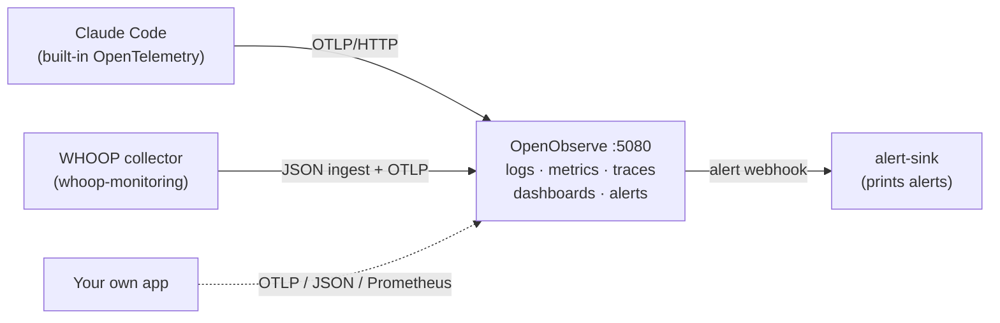
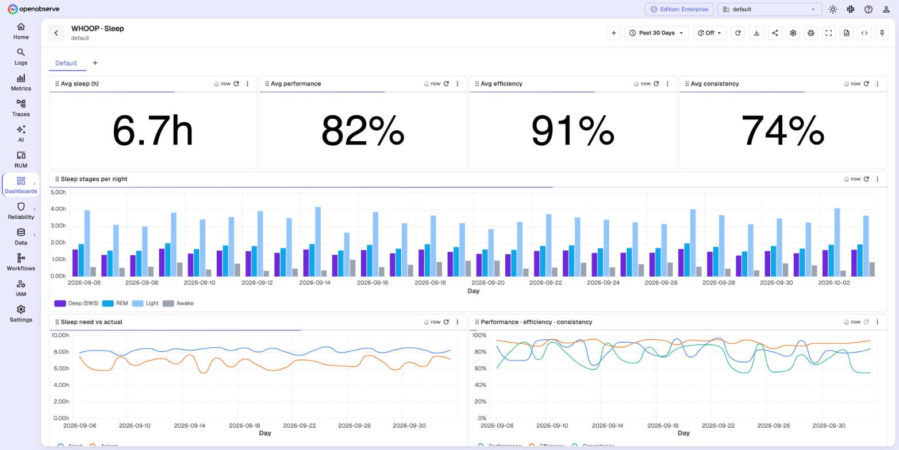
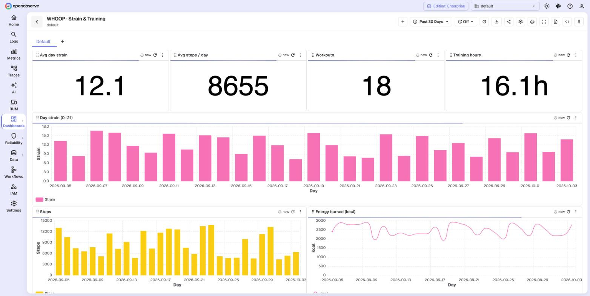

# openobserve-playground

Run [OpenObserve](https://openobserve.ai) on your laptop in one command, then point real data at it.
Two ready-made examples are included: **Claude Code telemetry** and **WHOOP health data**.




## Quick start

You need Docker (Desktop or Engine with Compose v2), `make` and `curl`.

```bash
git clone https://github.com/Iamrushabhshahh/openobserve-playground.git
cd openobserve-playground
cp .env.example .env        # set your own email and a strong password (rule in the file)
make up                     # starts OpenObserve and waits until it is healthy
```

Open <http://localhost:5080> and log in with the values from `.env`.

## Examples

| Example | What you get | Start |
|---|---|---|
| [Claude Code](examples/claude-code/) | Every prompt, model call and tool call as traces, logs and metrics. Three dashboards (Ops: latency, cache, tool failures, MCP health, cost per repo; traces; usage) and three alerts (daily cost, API errors, MCP failures). Content capture is opt-in. | `make claude-code` |
| [WHOOP](examples/whoop/) | Recovery, HRV, sleep stages, strain, workouts. Four dashboards and five alerts. | See [examples/whoop](examples/whoop/) |

<table>
  <tr>
    <td></td>
    <td></td>
  </tr>
</table>

*Screenshots use synthetic data.*

## Send your own data

| Protocol | Endpoint | Auth |
|---|---|---|
| OTLP/HTTP (traces, logs, metrics) | `http://localhost:5080/api/default` (the SDK appends `/v1/traces` etc.) | `Authorization: Basic base64(email:password)` |
| JSON logs | `POST http://localhost:5080/api/default/<stream>/_json` with a JSON array | Basic auth |
| Prometheus remote write | `http://localhost:5080/api/default/prometheus/api/v1/write` | Basic auth |

```bash
# Smallest possible test: one log line into a stream called "hello"
source .env
curl -u "$ZO_ROOT_USER_EMAIL:$ZO_ROOT_USER_PASSWORD" \
  -d '[{"message":"hello from the playground","level":"info"}]' \
  http://localhost:5080/api/default/hello/_json
```

Then open **Logs** → stream `hello`.

## Commands

```text
make up            start and wait for /healthz
make status        container, version, data size
make logs          follow server logs
make restart       apply changes to docker-compose.yml or .env
make backup        stop, archive ./data into backups/, start
make reset         delete ./data and start empty (asks first)
make claude-code   send Claude Code telemetry here + import its dashboards
make claude-code-alerts   import the Claude Code alerts (after the first prompt)
make alerts-log    watch alerts arriving in the alert-sink container
make down          stop (data stays)
```

## Settings and why

| Setting | Value | Why |
|---|---|---|
| Image | `openobserve-enterprise:v0.92.2` | Pinned, so a restart never upgrades your data by surprise. Change with `O2_IMAGE` in `.env`. |
| `ZO_INGEST_ALLOWED_UPTO` | `87600` hours | The default (5 h) drops older events with "Too old data". Needed to load history such as a WHOOP backfill. |
| `ZO_SKIP_SSRF_CHECKS` | `true` | Lets alerts call services on your laptop (`host.docker.internal`). **Local use only. Remove it on any server other people can reach.** |
| `O2_SERVICE_STREAMS_ENABLED` | `true` | Service discovery links a service's logs, traces and metrics. Without it, a trace's **View Logs** opens an empty stream. `make up` adds a "local" identity set so laptop data (no Kubernetes/cloud fields) is discovered. |
| `ZO_ENABLE_CROSS_LINKING` | `true` | Custom drill-down links on log and trace records. |
| `ZO_TELEMETRY` | `false` (in `.env.example`) | No anonymous usage reports. |
| Data | `./data` bind mount | Easy to back up, inspect or delete. |

### Which image?

The default is the **Enterprise** build. OpenObserve lets you self-host it for free up to a daily
ingestion limit; check the current terms in the
[license docs](https://openobserve.ai/docs/enterprise-setup/license-and-pricing/). A laptop
playground stays far below it. To use the **open-source** build instead, add this to `.env`:

```bash
O2_IMAGE=public.ecr.aws/zinclabs/openobserve:v0.92.2
```

Then run `make restart`. Use a fresh `./data` when you switch builds.

## Upgrade

```bash
make backup
echo 'O2_IMAGE=o2cr.ai/openobserve/openobserve-enterprise:<new-version>' >> .env
make restart
```

Restore a backup with `make down && mv data data.old && tar -xzf backups/<file>.tgz && make up`.

## Troubleshooting

| Symptom | Fix |
|---|---|
| `make up` times out; logs say "ZO_ROOT_USER_PASSWORD is too weak" | Use 8–128 characters with a lowercase, an uppercase, a digit and a special character. Then `make restart`. |
| Port 5080 is in use | Another OpenObserve runs. `docker ps`, then stop it, or change the port in `docker-compose.yml`. |
| Login fails after changing `.env` | The login is stored in `./data` on first start. Change it in the UI, or `make reset`. |
| "Too old data" when you ingest | `ZO_INGEST_ALLOWED_UPTO` is missing. Run `make restart` after you fix it. |
| Trace → **View Logs** opens "Pick a stream" | Service discovery has not seen the service yet: wait up to 10 minutes after new data, or open the span's **Logs** tab. Check with `curl -u … localhost:5080/api/default/service_streams`. View Logs matches by service + time window; add `AND trace_id = '…'` for one trace. |
| Log line has no "View Trace" button | Turn **More → Quick Mode** off in Logs. Quick Mode fetches only visible columns, so `trace_id` is missing. |
| A dashboard shows 0 or old numbers | The UI caches panel results. Click the refresh button on the dashboard. |
| Alert creation fails with "SSRF guard" | The destination is a private host and `ZO_SKIP_SSRF_CHECKS` is not set. |

## License

MIT for the files in this repo. OpenObserve itself has its own license (see above).
This project is not affiliated with OpenObserve, Anthropic or WHOOP.
