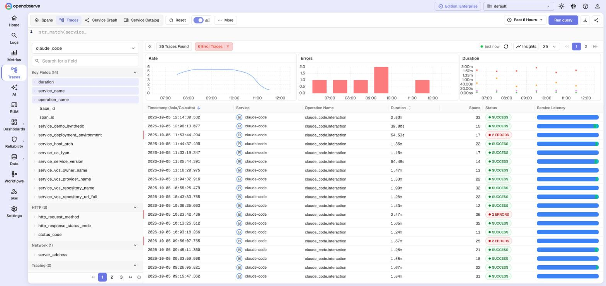
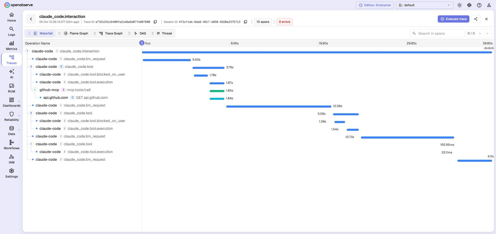
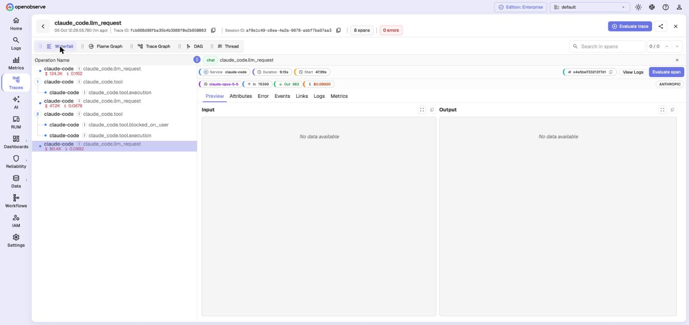
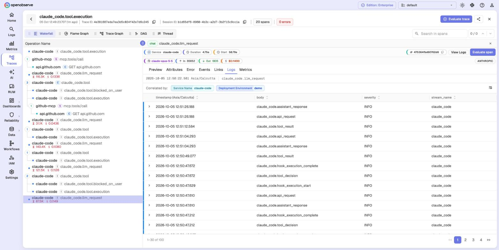
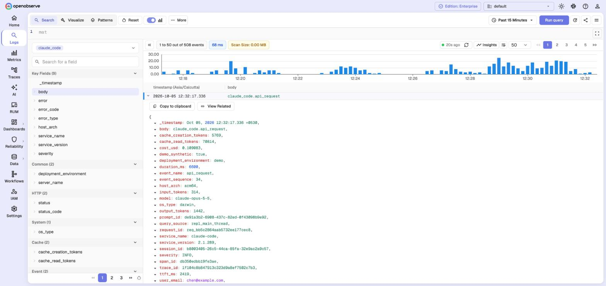
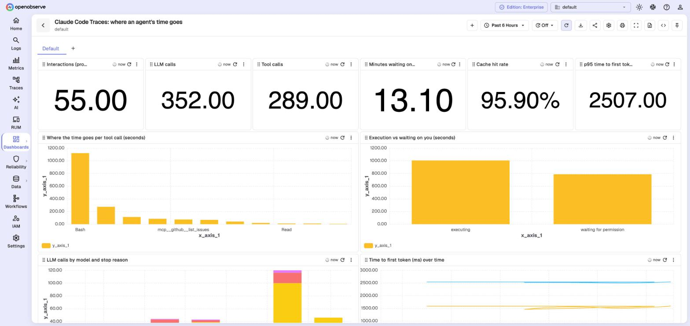
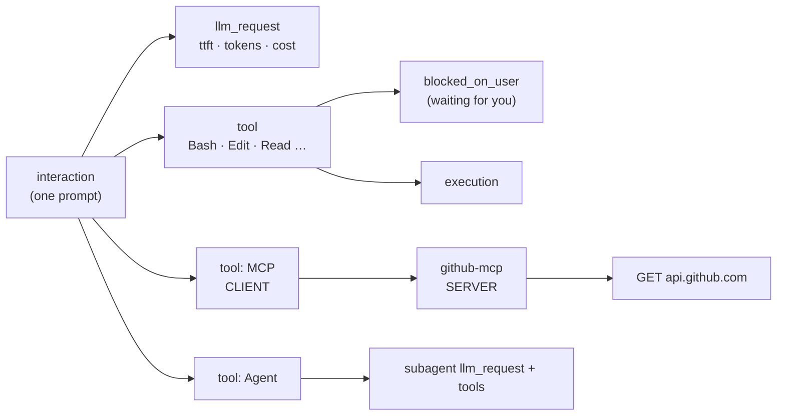

# openobserve-playground

**Distributed tracing for AI agents, on your laptop, in two commands.**
Run [OpenObserve](https://openobserve.ai) locally, load realistic agent traces, and explore
waterfalls, spans, the service graph and the jump between traces and logs. Then point your own
Claude Code (or any OpenTelemetry app) at it.

```bash
cp .env.example .env && make up    # OpenObserve on http://localhost:5080
make demo                          # 6 h of synthetic agent traces + logs + metrics
```


## What you can explore

| | |
|---|---|
|  | **Traces list with RED metrics.** One row per prompt: duration, span count, status, per-service latency. Rate, errors and duration on top. |
|  | **One trace across services.** The agent's MCP tool call (`CLIENT`) continues in the `github-mcp` server (`SERVER`) and its call to GitHub. |
|  | **Service graph built from spans.** Agent → models (from GenAI attributes) → MCP server → upstream API. Border colour = error rate. |
|  | **Model calls as GenAI spans.** Model, tokens in/out and cost per call, from OpenTelemetry `gen_ai.*` attributes. |
|  | **Trace → logs in one panel.** Select a span, open **Logs**: the service's log events, correlated by service discovery, next to the waterfall. |
|  | **Logs that know their trace.** Every event carries `trace_id` and `span_id`; jump log → trace with **View Related**. |
|  | **Traces as numbers.** SQL over spans: where an agent's time goes, cache hit rate, time to first token. |

The full walkthrough with queries is in **[docs/TRACING.md](docs/TRACING.md)**.

## Anatomy of an agent trace



`make demo` produces exactly this shape, with the same span names and attributes as real
Claude Code telemetry. Every synthetic record has `demo.synthetic=true`.

## Quick start

You need Docker (Desktop or Engine with Compose v2), `make`, `curl` and Python 3.

```bash
git clone https://github.com/Iamrushabhshahh/openobserve-playground.git
cd openobserve-playground
cp .env.example .env        # set your own email and a strong password (rule in the file)
make up                     # starts OpenObserve, waits until healthy, sets up service discovery
make demo                   # synthetic traces + the Claude Code dashboards
make demo-live              # optional: a new agent task every ~20 s
```

Open <http://localhost:5080> → **Traces** → stream `claude_code`.

## Bring real traces

| Source | Start | Notes |
|---|---|---|
| [Claude Code](examples/claude-code/) | `make claude-code` | Real agent traces, logs and metrics from every session. Three dashboards and three alerts. Prompt/tool content is opt-in. |
| [WHOOP](examples/whoop/) | see example | A Python collector with its own traces (`sync.run` → `sync.resource` → `whoop.request`) plus health dashboards. |
| Any OpenTelemetry SDK | env vars below | Traces, logs and metrics over OTLP/HTTP. |

```bash
export OTEL_EXPORTER_OTLP_ENDPOINT=http://localhost:5080/api/default
export OTEL_EXPORTER_OTLP_HEADERS="Authorization=Basic $(printf '%s:%s' "$ZO_ROOT_USER_EMAIL" "$ZO_ROOT_USER_PASSWORD" | base64),stream-name=my_app"
export OTEL_EXPORTER_OTLP_PROTOCOL=http/protobuf
```

| Protocol | Endpoint |
|---|---|
| OTLP/HTTP (traces, logs, metrics) | `http://localhost:5080/api/default` (the SDK appends `/v1/traces` etc.) |
| JSON logs | `POST http://localhost:5080/api/default/<stream>/_json` with a JSON array |
| Prometheus remote write | `http://localhost:5080/api/default/prometheus/api/v1/write` |

All use Basic auth with the login from `.env`.

## Commands

```text
make up            start, wait for /healthz, set up service discovery
make demo          load synthetic agent traces + import Claude Code dashboards
make demo-live     keep generating agent tasks (Ctrl+C to stop)
make claude-code   send your real Claude Code telemetry here + dashboards
make claude-code-alerts   import the Claude Code alerts (after the first prompt)
make alerts-log    watch alerts arriving in the alert-sink container
make status        container, version, data size
make logs          follow server logs
make restart       apply changes to docker-compose.yml or .env
make backup        stop, archive ./data into backups/, start
make reset         delete ./data and start empty (asks first)
make down          stop (data stays)
```

## Settings and why

| Setting | Value | Why |
|---|---|---|
| Image | `openobserve-enterprise:v0.92.2` | Pinned, so a restart never upgrades your data by surprise. Change with `O2_IMAGE` in `.env`. |
| `O2_SERVICE_STREAMS_ENABLED` | `true` | Service discovery links each service's logs, traces and metrics. Needed for trace → **View Logs** and the span **Logs** tab. `make up` adds a "local" identity set so laptop data (no Kubernetes/cloud fields) is discovered. |
| `O2_SERVICE_STREAMS_SAMPLE_RATE` | `1` | Look at every record; a laptop sends little data. |
| `O2_SERVICE_GRAPH_PROCESSING_INTERVAL_SECS` | `60` | Service graph appears a minute after new spans, not after the default interval. |
| `ZO_ENABLE_CROSS_LINKING` | `true` | Drill-down links on log and trace records. |
| `ZO_INGEST_ALLOWED_UPTO` | `87600` hours | The default (5 h) drops older events with "Too old data". `make demo` writes 6 h of history. |
| `ZO_SKIP_SSRF_CHECKS` | `true` | Lets alerts call services on your laptop. **Local use only. Remove it on any server other people can reach.** |
| `ZO_TELEMETRY` | `false` (in `.env.example`) | No anonymous usage reports. |
| Data | `./data` bind mount | Easy to back up, inspect or delete. |

### Which image?

The default is the **Enterprise** build, because some features here (service discovery, which
powers trace → logs) are Enterprise-only. OpenObserve lets you self-host it for free up to a daily ingestion limit;
see the [license docs](https://openobserve.ai/docs/enterprise-setup/license-and-pricing/). A
laptop playground stays far below it. The open-source build also handles traces, logs and
metrics; some links described here may be missing:

```bash
O2_IMAGE=public.ecr.aws/zinclabs/openobserve:v0.92.2   # in .env, then make restart (fresh ./data)
```

## Troubleshooting

| Symptom | Fix |
|---|---|
| `make up` times out; logs say "ZO_ROOT_USER_PASSWORD is too weak" | Use 8–128 characters with a lowercase, an uppercase, a digit and a special character. Then `make restart`. |
| Trace → **View Logs** opens "Pick a stream" | Service discovery has not seen the service yet: wait up to 10 minutes after new data, or open the span's **Logs** tab. Check `curl -u … localhost:5080/api/default/service_streams`. View Logs matches by service + time window; add `AND trace_id = '…'` for one trace. |
| Log line has no "View Trace" / "View Related" button | Turn **More → Quick Mode** off in Logs. Quick Mode fetches only visible columns, so `trace_id` is missing. |
| Service graph is empty | It is built every 60 s from recent spans. Run `make demo-live` for a minute, then refresh. |
| OTLP/JSON request fails with `invalid type: map, expected f64` | OpenObserve v0.92.2 rejects `doubleValue` attributes over OTLP/JSON. Use OTLP/protobuf (SDK default) or send floats as strings. |
| Two OpenObserve tabs keep logging each other out | Browsers share cookies across ports on `localhost`. Open the second instance on `127.0.0.1:<port>`. |
| Port 5080 is in use | Another OpenObserve runs. `docker ps`, then stop it, or change the port in `docker-compose.yml`. |
| Login fails after changing `.env` | The login is stored in `./data` on first start. Change it in the UI, or `make reset`. |
| A dashboard shows 0 or old numbers | The UI caches panel results. Click the refresh button on the dashboard. |

## Upgrade and backup

```bash
make backup
echo 'O2_IMAGE=o2cr.ai/openobserve/openobserve-enterprise:<new-version>' >> .env
make restart
```

Restore with `make down && mv data data.old && tar -xzf backups/<file>.tgz && make up`.

## License

MIT for the files in this repo. OpenObserve has its own license (see above).
This project is not affiliated with OpenObserve, Anthropic or WHOOP. Screenshots use synthetic data.
