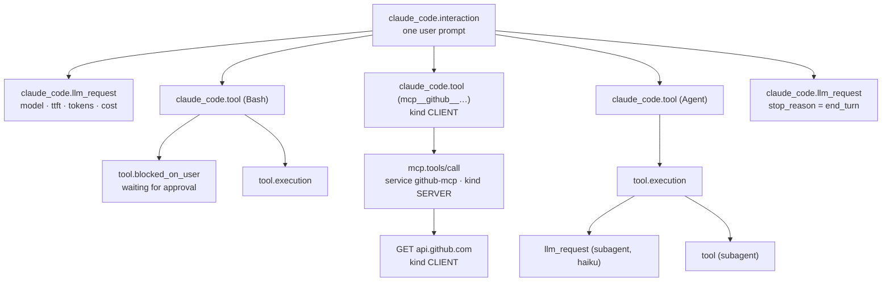
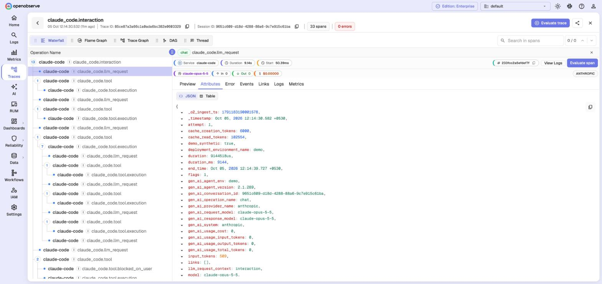

# Tracing tour

This page walks through distributed tracing in OpenObserve with an AI coding agent as the
example. Every screenshot uses the synthetic data from `make demo`, so you can follow along
on your own laptop in about two minutes.

```bash
make up      # start OpenObserve
make demo    # 6 hours of synthetic agent traces, logs and metrics
```

## 1. The shape of an agent trace

One user prompt is one trace. The agent alternates between model calls and tool calls until it
answers.



| Span | Key attributes |
|---|---|
| `claude_code.interaction` | `interaction.sequence`, `user_prompt_length`, `session.id` |
| `claude_code.llm_request` | `model`, `ttft_ms`, `duration_ms`, `input_tokens`, `output_tokens`, `cache_read_tokens`, `stop_reason`, `agent_id` (subagents), GenAI `gen_ai.*` |
| `claude_code.tool` | `tool_name`, `tool_use_id`, `bash_argv0`, `bash_command_class`, `success` |
| `claude_code.tool.blocked_on_user` | `decision`, `source`, `duration_ms` |
| `claude_code.tool.execution` | `success`, `error`, `error_class` |

## 2. Find traces: Traces → stream `claude_code`

The **Traces** view shows one row per prompt with its duration, span count, status and a
per-service latency bar. Rate, Errors and Duration charts sit on top (RED metrics).


Useful filters (query bar, SQL `WHERE` syntax):

```sql
operation_name = 'claude_code.tool' AND tool_name = 'Bash'
span_status = 'ERROR'
operation_name = 'claude_code.llm_request' AND CAST(ttft_ms AS INT) > 2000
```

## 3. Read one trace: the waterfall

Nesting shows causality. Here the agent hands work to a **subagent** (`Agent` tool): the
subagent's model calls and tools sit inside `tool.execution`. `blocked_on_user` bars show time
spent waiting for you to approve a command.


**Across services.** An MCP tool call is a `CLIENT` span in `claude-code`. The MCP server
continues the same trace as a `SERVER` span in `github-mcp`, then calls GitHub as a `CLIENT`.
Each service gets its own colour.


## 4. Inspect a span: model calls are GenAI spans

Click a span for its attributes. Model-call spans carry the OpenTelemetry GenAI conventions
(`gen_ai.usage.input_tokens`, `gen_ai.usage.output_tokens`, `gen_ai.usage.cost`, ...), so
OpenObserve shows model, tokens in/out and cost in the span header, and token totals and cost
under each model call in the waterfall.




## 5. See the whole system: Service Graph

Traces → **Service Graph** → **Graph View**. OpenObserve builds the map from the spans:
the agent, the models it calls (from the GenAI attributes), the MCP server and its upstream.
Border colour is the error rate.


The playground sets `O2_SERVICE_GRAPH_PROCESSING_INTERVAL_SECS=60`, so the graph appears about
a minute after new spans arrive.

## 6. Jump between logs and traces

Every log event carries the `trace_id` and `span_id` of the span that produced it.

**Log → trace.** In **Logs**, turn **More → Quick Mode** off, expand an event, then use
**View Related → Traces** (or **View Trace**).


**Trace → logs.** In a trace, select a span and open its **Logs** tab, or click **View Logs**.


This uses service discovery (`O2_SERVICE_STREAMS_ENABLED=true` plus the "local" identity set
that `make up` adds). New services appear after the next discovery flush (up to 10 minutes).
To narrow to one trace, add `AND trace_id = '<id>'` to the logs query.

## 7. Turn traces into numbers: dashboards and alerts

Span data is queryable with SQL like any stream, so dashboards can answer "where does an
agent's time go?":


```sql
-- model time vs tool execution vs waiting on you, per hour
SELECT histogram(_timestamp, '1 hour') AS t,
  SUM(CASE WHEN operation_name = 'claude_code.llm_request'          THEN TRY_CAST(duration_ms AS DOUBLE) END) / 1000 AS model_s,
  SUM(CASE WHEN operation_name = 'claude_code.tool.execution'       THEN TRY_CAST(duration_ms AS DOUBLE) END) / 1000 AS tools_s,
  SUM(CASE WHEN operation_name = 'claude_code.tool.blocked_on_user' THEN TRY_CAST(duration_ms AS DOUBLE) END) / 1000 AS waiting_s
FROM "claude_code" GROUP BY t ORDER BY t
```

Claude Code sends some numeric span attributes as text, hence `TRY_CAST`.

## 8. Your own traces

| Source | How |
|---|---|
| Claude Code (real) | `make claude-code` (see [examples/claude-code](../examples/claude-code/)) |
| A Python app | See the [whoop-monitoring](https://github.com/Iamrushabhshahh/whoop-monitoring) collector: `sync.run` → `sync.resource` → `whoop.request`, logs carry the trace id |
| Any OTel SDK | `OTEL_EXPORTER_OTLP_ENDPOINT=http://localhost:5080/api/default`, `OTEL_EXPORTER_OTLP_HEADERS=Authorization=Basic <base64 email:password>,stream-name=<stream>` |

## Known quirks (OpenObserve v0.92.2)

| Quirk | Effect | Workaround |
|---|---|---|
| OTLP/**JSON** rejects `doubleValue` attributes | `400 invalid type: map, expected f64` | Send floats as strings, or use OTLP/protobuf (all SDKs default to protobuf) |
| Logs **Quick Mode** fetches only visible columns | No View Trace button | More → Quick Mode off |
| Trace Graph and Service Graph **Tree View** layouts can collapse | Overlapping labels | Use Waterfall and Service Graph **Graph View** |
| Dashboards cache panel results | Old numbers | Click the dashboard refresh button |
