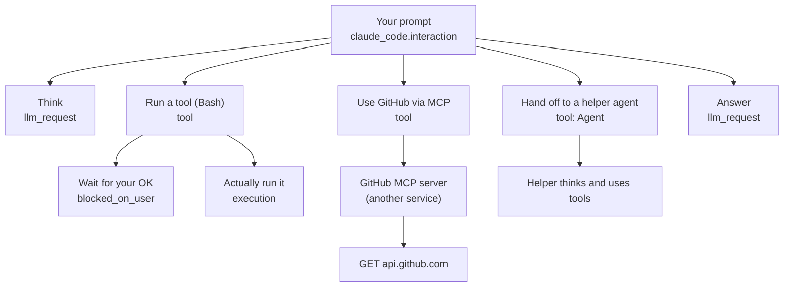
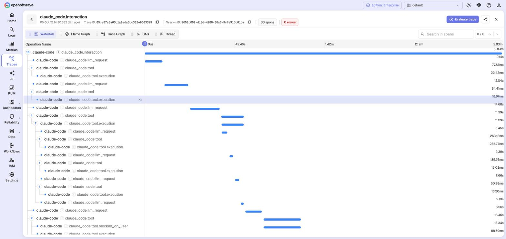
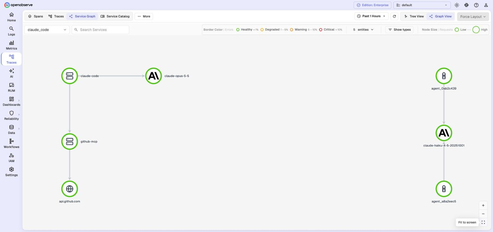

# A tour of tracing, with an AI agent

New to tracing? This page is for you. We'll use an AI coding agent as the example, because it
does a lot of small steps that are hard to follow without a picture.

You can follow along on your own laptop in about two minutes:

```bash
make up      # start OpenObserve
make demo    # load 6 hours of example agent activity
```

## First, three words

- A **trace** is the story of one task, from start to finish. Here: one thing you asked the agent to do.
- A **span** is one step in that story: "called the model", "ran `pytest`", "waited for you".
- Spans can sit **inside** other spans. That's how you see that a step was part of a bigger step.

## 1. What an agent task looks like

When you ask the agent something, it goes back and forth: think (model call), do (tool), think,
do, until it has an answer. Sometimes it waits for your OK, hands work to a helper agent, or
calls another service.



## 2. The list of tasks

Go to **Traces** and pick the stream `claude_code`. Each row is one task: when it ran, how
long it took, how many steps it had, and whether something failed. The three small charts on
top show how many tasks ran, how many had errors, and how long they took.


Want to narrow it down? Type a filter in the search bar:

```sql
tool_name = 'Bash'                                   -- only shell commands
span_status = 'ERROR'                                -- only things that failed
operation_name = 'claude_code.llm_request' AND CAST(ttft_ms AS INT) > 2000   -- slow model replies
```

## 3. One task, step by step

Click a row. This view is called a **waterfall**: time runs left to right, and each bar is a
step.



Things to notice:

- Long bars under **llm_request** are the agent thinking.
- **blocked_on_user** is the agent waiting for you to approve something. Often it's the slowest part!
- The block with lots of steps inside is a **helper agent** doing part of the job.

Some tasks cross into **another service**. Here the agent asks a GitHub MCP server for issues,
and that server calls the GitHub API. It's all one trace, with a different colour per service:


## 4. Look inside a step

Click any bar to see its details. Model calls show the model, tokens in and out, and the cost,
right at the top. In the waterfall, each model call also shows its token count and cost.


The **Attributes** tab has everything else that was recorded about the step:


## 5. The big picture

**Traces → Service Graph → Graph View** draws everything the agent talked to: the AI models,
the MCP server, and GitHub behind it. A green border means few errors; red means many.



It's rebuilt every minute, so give it a moment after new data arrives.

## 6. Logs and traces, together

Every log line remembers which step it came from. So you can go either way:

**From a trace to its logs.** Click a step, then the **Logs** tab:


**From a log line to its trace.** On the **Logs** page, open **More** and switch
**Quick Mode** off. Then expand a log line and click **View Related → Traces**:


If "View Logs" ever opens an empty page, wait a few minutes: OpenObserve links services to
their logs every 10 minutes.

## 7. Turn steps into numbers

Steps are data, so you can ask questions with SQL and put the answers on a dashboard. For
example, "where does the agent's time go?":


```sql
SELECT histogram(_timestamp, '1 hour') AS hour,
  SUM(CASE WHEN operation_name = 'claude_code.llm_request'          THEN TRY_CAST(duration_ms AS DOUBLE) END) / 1000 AS thinking_seconds,
  SUM(CASE WHEN operation_name = 'claude_code.tool.execution'       THEN TRY_CAST(duration_ms AS DOUBLE) END) / 1000 AS tool_seconds,
  SUM(CASE WHEN operation_name = 'claude_code.tool.blocked_on_user' THEN TRY_CAST(duration_ms AS DOUBLE) END) / 1000 AS waiting_seconds
FROM "claude_code" GROUP BY hour ORDER BY hour
```

(`TRY_CAST` is there because Claude Code sends some numbers as text.)

## 8. Now try it with real data

| Source | How |
|---|---|
| Your own Claude Code | `make claude-code`, then start a new session. See [claude-code/](../claude-code/). |
| A small Python app | The [whoop-monitoring](https://github.com/Iamrushabhshahh/whoop-monitoring) collector traces each sync: `sync.run → sync.resource → whoop.request`. |
| Your own app | Any OpenTelemetry SDK. See [Send your own data](settings.md#send-your-own-data). |

Something looks off? See [troubleshooting](troubleshooting.md).

---

### What the example data contains

`make demo` writes data in exactly the same shape as real Claude Code, plus a GitHub MCP server
as a second service. Every record is tagged `demo.synthetic=true`.

| Step | Recorded details |
|---|---|
| `claude_code.interaction` | prompt length, session id |
| `claude_code.llm_request` | model, time to first token (`ttft_ms`), duration, tokens, cache use, why it stopped, cost |
| `claude_code.tool` | tool name, command type (for Bash), success |
| `claude_code.tool.blocked_on_user` | how long you took, your decision |
| `claude_code.tool.execution` | success, error |
