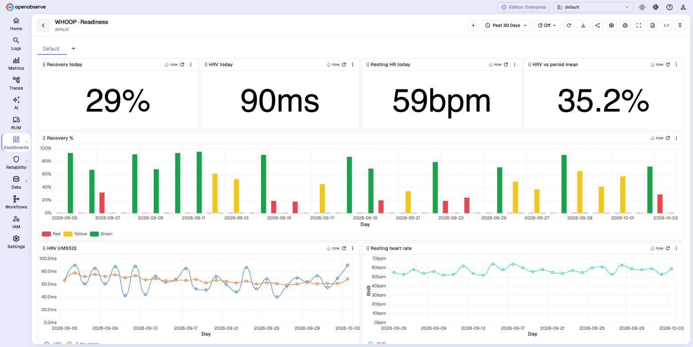

# WHOOP → OpenObserve

The collector lives in its own repo:
**[Iamrushabhshahh/whoop-monitoring](https://github.com/Iamrushabhshahh/whoop-monitoring)**.
It reads the WHOOP Developer API v2 and writes recovery, sleep, strain, workouts and body
measurements into this playground. It also creates four dashboards and five alerts.



## Steps

1. Start the playground: `make up` (repo root).
2. Clone the collector next to it:

   ```bash
   git clone https://github.com/Iamrushabhshahh/whoop-monitoring.git
   cd whoop-monitoring && cp .env.example .env
   ```

3. In the collector's `.env`, use the **same login** as the playground:

   ```bash
   O2_URL=http://localhost:5080
   O2_URL_FROM_DOCKER=http://host.docker.internal:5080
   O2_USER=<ZO_ROOT_USER_EMAIL from the playground .env>
   O2_PASSWORD=<ZO_ROOT_USER_PASSWORD from the playground .env>
   ALERT_WEBHOOK_URL=http://host.docker.internal:8080/o2-alert
   ```

4. Create a WHOOP developer app and log in. Follow the collector's
   [SETUP.md](https://github.com/Iamrushabhshahh/whoop-monitoring/blob/main/SETUP.md), steps 2–7:
   `make login`, `make backfill`, `make provision`, `make up`.

## Why the playground has these settings

| Setting | Needed because |
|---|---|
| `ZO_INGEST_ALLOWED_UPTO=87600` | A backfill writes events from months ago. WHOOP also scores sleep hours after it ends. |
| `ZO_SKIP_SSRF_CHECKS=true` | The alerts post to the collector on your laptop (`host.docker.internal:8080/o2-alert`). |

## Dashboards

| Dashboard | Shows |
|---|---|
| WHOOP · Readiness | Recovery % by zone, HRV with 7-day mean, resting HR, SpO2, skin temp |
| WHOOP · Sleep | Stages per night, need vs actual, performance/efficiency/consistency |
| WHOOP · Strain & Training | Day strain, steps, kcal, HR-zone minutes, workouts |
| WHOOP · Collector Health | Sync runs, rows shipped, rate limits, errors |
